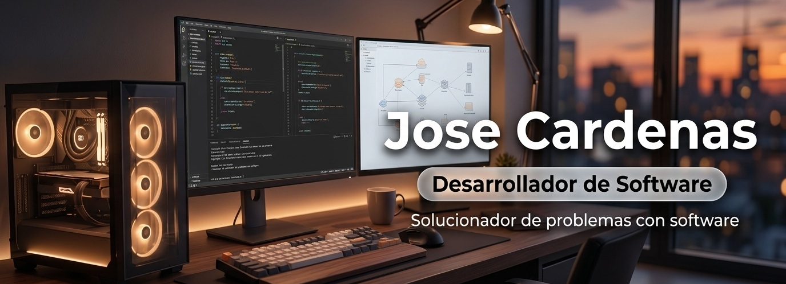

<!-- BANNER PRINCIPAL PANORÁMICO -->

  

<!-- TEXTO DINÁMICO FORMAL -->

  

<!-- INDICADORES DE ESTADO -->

  
  

---

## 💼 Perfil Profesional

Desarrollador de Software especializado en el diseño de **arquitecturas escalables**, **servicios asíncronos de alta disponibilidad** y la **integración de modelos de Inteligencia Artificial** en flujos de automatización empresarial. 

Cuento con sólida formación en **infraestructura de redes (Cisco CCNA)**, **seguridad informática / pentesting** y despliegues en entornos **Cloud (AWS)**, aplicando metodologías ágiles y principios de *Security by Design* en cada etapa del ciclo de vida del software.

- 🤖 **IA & Automatización:** Implementación de agentes autónomos, integración con modelos LLM y orquestación con LangChain y n8n.
- ⚙️ **Backend & APIs:** Servicios asíncronos de alto rendimiento, microservicios y APIs REST escalables.
- 🛡️ **Seguridad & Redes:** Auditorías de seguridad, análisis de vulnerabilidades y gestión de redes empresariales.
- ☁️ **Infraestructura Cloud:** Despliegue y mantenimiento de cargas de trabajo sobre AWS y contenedores Docker.

---

## 🛠️ Stack Tecnológico & Especialidades

### 🤖 IA & Automatización
> *Orquestación multi-modelo y agentes de lenguaje natural.*

  
  
  
  
  

### ⚙️ Desarrollo & APIs
> *Servicios asíncronos y arquitecturas escalables.*

  
  
  

### 💻 Frontend & Web Apps
> *Maquetación semántica, interfaces reactivas y responsivas.*

  
  
  
  
  

### 🔒 Redes, Cloud & Sec
> *Pentesting, certificación Cisco e infraestructura AWS.*

  
  
  
  
  
  

## 📬 Contacto Profesional

  
  &nbsp;
  
  &nbsp;
  

